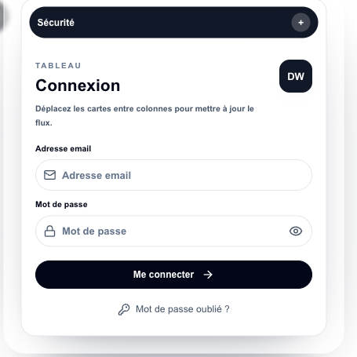

# Design Workflow Backend

## Purpose

Design Workflow Backend is the Django API for collaborative design project tracking. It manages workflow users, projects, tasks, comments, activity, attachments, chat data, and real-time updates.

## Stack

- Python and Django
- Django REST Framework
- Simple JWT and dj-rest-auth
- django-filter
- Channels, Daphne, Redis, and Celery
- PostgreSQL
- Pytest and pytest-django

## Features

- Design project and task APIs
- Assignment, review, and status workflows
- Comments, activity logs, and attachments
- Team and permission management
- Chat and websocket integration
- Dashboard data for workflow boards

## Setup

Provide local-only variables for Django runtime settings, database, Redis, media storage, and allowed origins. Use localhost values for local development and do not commit local configuration files.

```bash
python -m venv .venv
source .venv/bin/activate
pip install -r requirements.txt
python manage.py migrate
python manage.py runserver 8004
```

## Tests

```bash
python -m pytest
```

## Screenshot


